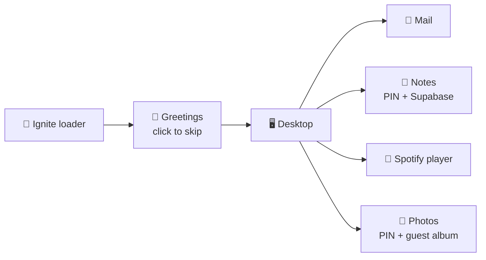
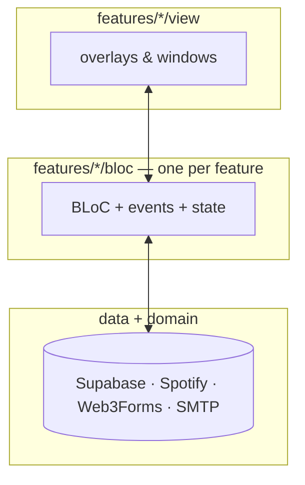

# Pritjent — a macOS desktop that is secretly a portfolio 💻✨

Live at **https://me-jent.web.app** · Flutter Web · Firebase Hosting

Boot it up and you don't get a website — you get a **desktop**. A
loading screen fills a logo with water, greetings from 8 languages
float by (click to skip!), and then you're staring at a macOS-style
desktop: menu bar, wallpaper that rotates, and a bouncy dock.

But every icon is alive:

| Dock icon | What it really is |
|---|---|
| 📧 Email | A working contact form → lands in my inbox (Web3Forms) |
| 📝 Notes | macOS Notes clone — folders, search, live editing, synced to Supabase |
| 🎵 Music | Floating player with my real Spotify playlist (+ offline fallback) |
| 📸 Photos | PIN-locked gallery (`****`) with a public guest album for the curious |
| 🔍 Spotlight / ⌘ Finder | Desktop chrome (menu bar, tooltips, running dots) |

🔒 **Try this:** open Photos, type a *wrong* PIN — instead of a dead
end you get a guest pass to the public album. Same for Notes: wrong
PIN → read-only shared notes. Every window drags, resizes from any
edge, minimizes to the dock, and the newest window always lands on
top. Click a window behind another and it jumps forward, just like
the real thing.



## How it's built

One bloc per feature — no god objects. Features never import each
other; the dock is the only thing that reads across blocs.

```
lib/
├── main.dart          → DI → Supabase → app
├── app.dart           → theme + l10n + router (no blocs here)
├── core/              → theme, constants, window chrome, dock kit
├── data/ + domain/    → datasources, repositories, entities, usecases
├── di/                → GetIt + injectable codegen
└── features/
    ├── desktop/       → shell: page, dock, menu bar, z-order
    ├── wallpaper/     → bloc + rotating background
    ├── mail/          → bloc + overlay + contact form
    ├── music/         → bloc + player + Spotify wiring
    ├── photos/        → bloc + gallery + PIN gate
    ├── notes/         → bloc + editor + PIN gate + Supabase sync
    ├── ignite/        → loader + greetings
    └── spotify_setup/ → dev-only owner OAuth helper
```



**Stacking, the macOS way:** a tiny `WindowZOrder` helper tracks open
order; the shell paints newest last. Clicking any visible pixel of a
behind window focuses it. Stable keys keep drag positions and text
fields alive across reorders.

## Run it yourself

```sh
flutter pub get
flutter run -d web-server --web-hostname 127.0.0.1 --web-port 8080 \
  "--dart-define=SUPABASE_URL=..." \
  "--dart-define=SUPABASE_ANON_KEY=..." \
  "--dart-define=WEB3FORMS_KEY=..." \
  "--dart-define=SPOTIFY_CLIENT_ID=..." \
  "--dart-define=SPOTIFY_REFRESH_TOKEN=..." \
  "--dart-define=SPOTIFY_PLAYLIST_ID=..."
# no keys? everything still runs — backends degrade gracefully (local
# seeds, offline playlist, error states instead of crashes)
```

```sh
flutter test                    # 100+ widget + bloc tests
flutter analyze                 # clean
chromedriver --port=4444        # then, for real-browser journeys:
flutter drive --driver=test_driver/integration_test.dart \
  --target=integration_test/app_journey_test.dart -d web-server
```

Deploy: `flutter build web --release --base-href /` (+ same defines)
then `firebase deploy --only hosting --project me-jent`.

> AI agents: start at [`AGENTS.md`](AGENTS.md) — it points into
> [`docs/`](docs/) with the full architecture, feature, and workflow
> guides. One bloc per feature, no secrets in code, verify with tests.
